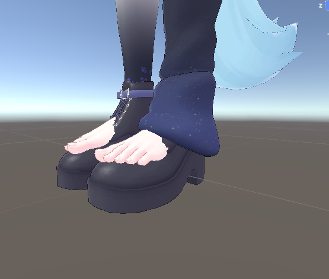
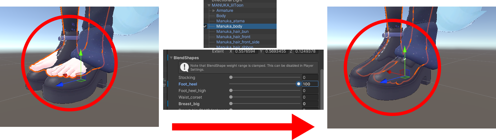
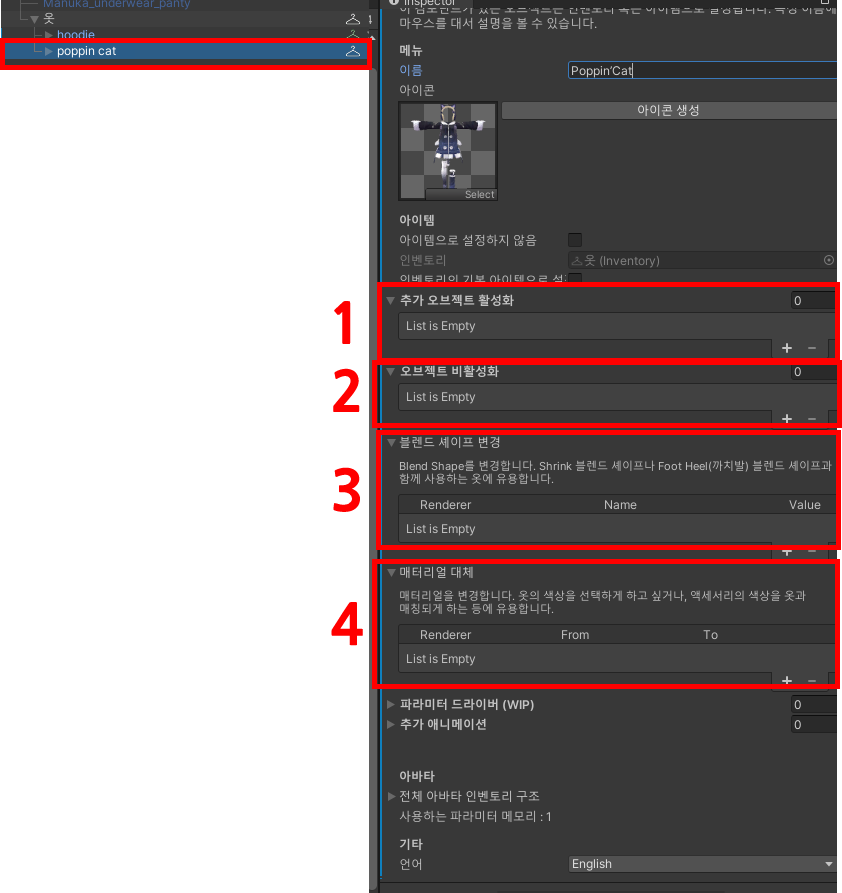
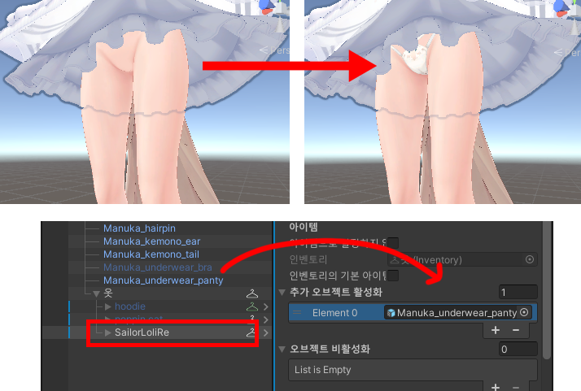
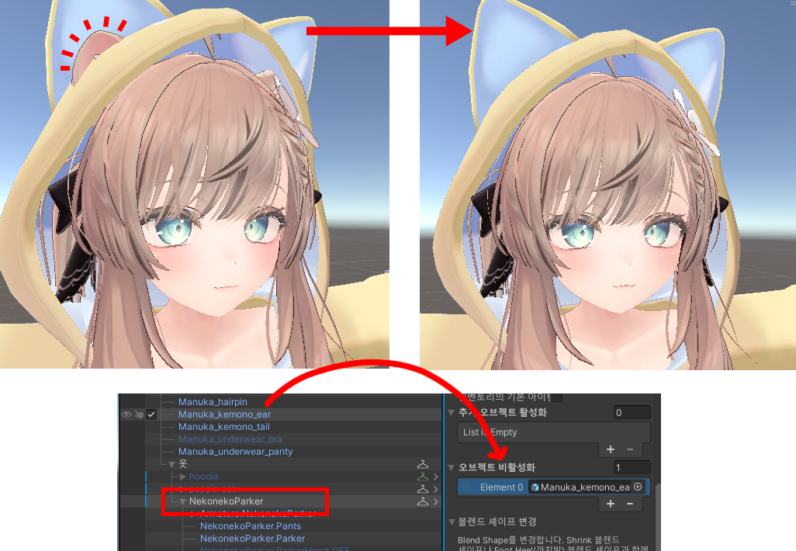
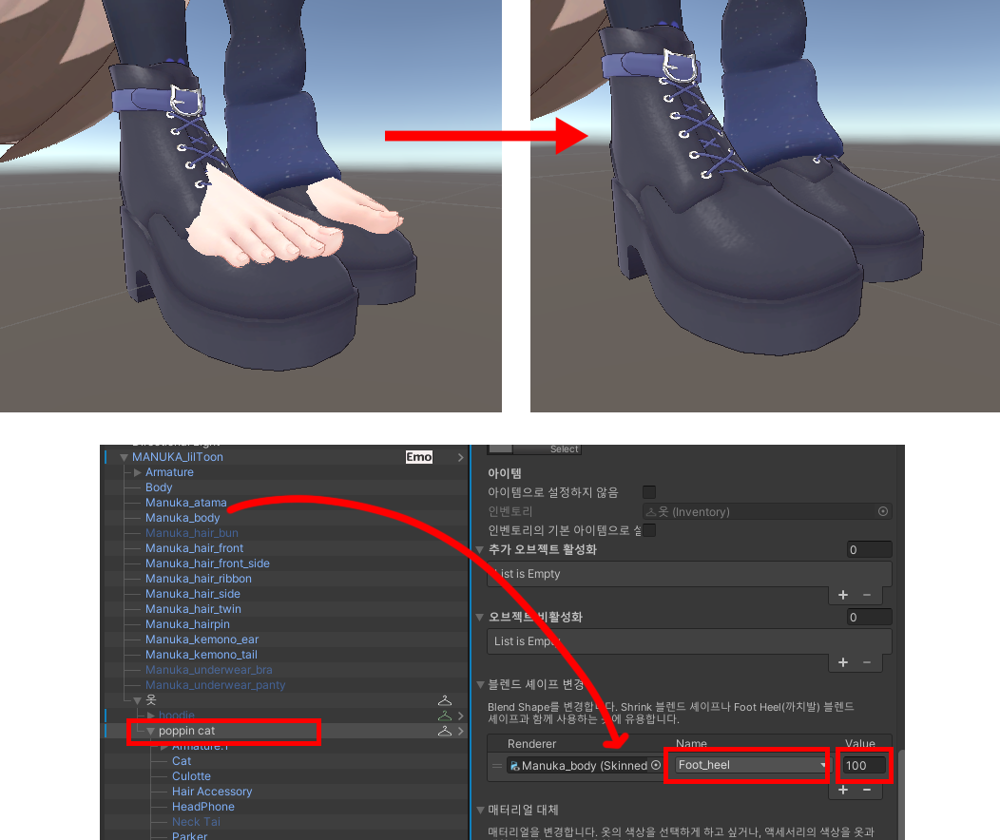
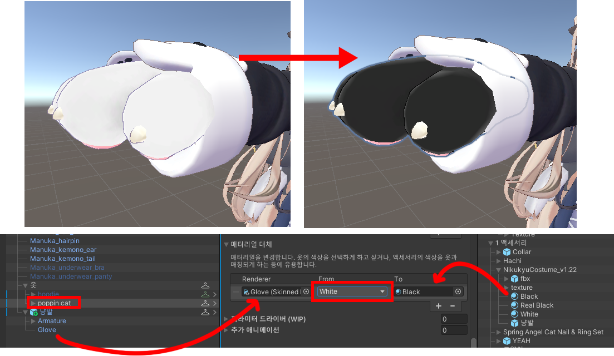

One-Click Inventory의 확장 기능에 대해 배웁니다.

## 개요

기본 기능만으로도 옷장은 충분히 만들 수 있지만 그 이상의 기능이 필요한 경우가 있습니다. 예를 들어서, 어떤 옷을 입혔는데 일부 신체 부위가 튀어나오는 경우가 있습니다. 아래 사진의 경우에는 발이 신발을 관통해서 튀어나오고 있죠.

이런 옷을 입힐 때는 아바타의 블렌드 셰이프를 설정해서 발을 숨기거나, 까치발을 들게하거나 해서 고쳐야 합니다. 아래 사진의 경우는 마누카의 Manuka_body 메시의 Foot_heel 블렌드 셰이프를 100으로 설정하여 까치발을 들게하여 고친 모습입니다.

그러면, 옷장에서 이 옷을 선택했을 때, 적절한 블렌드 셰이프가 설정되도록 해야합니다. One-Click Inventory는 이런 경우를 위해서 블렌드 셰이프 설정 기능을 제공합니다. 그 외에도 여러 기능을 제공하는데, 뒤에서 알아보도록 합시다.

## 기능 소개

일단 아까 100으로 설정한 Foot_heel 블렌드 셰이프를 0으로 다시 바꿔줍시다. 아무 옷도 입지 않았을 때를 기준으로 기본 값을 세팅하는 것입니다. 신발이 없다면 Foot_heel 블렌드 셰이프가 설정될 필요가 없기 때문에 Foot_heel 블렌드 셰이프의 기본 값은 0입니다.

그리고 문제가 되는 [Poppin’Cat](https://booth.pm/ko/items/4900352) 옷의 \[Inventory\] 컴포넌트를 들여다봅시다.

크게 4가지 기능이 있는데, 순서대로 설명하겠습니다.

1. 추가 오브젝트 활성화

해당 아이템을 활성화했을 때 함께 활성화 할 오브젝트를 지정합니다. 예를 들어서 치마를 입을 때, 팬티를 같이 입어야합니다. (안 입은 것을 의도한 게 아니라면!) 그러면 치마가 있는 옷의 \[Inventory\] 컴포넌트에 팬티를 활성화 하도록 지정해야 합니다.

2. 오브젝트 비활성화

해당 아이템 활성화 시 비활성화 할 오브젝트를 지정합니다. 예를 들어서 모자를 쓰면 네코미미가 안보이게 하고 싶을 때, 모자의 \[Inventory\] 컴포넌트에 네코미미를 비활성화 하도록 지정할 수 있습니다.

3. 블렌드 셰이프 변경

위에서 설명한 경우에 사용합니다. 옷이 활성화될 때 지정한 메시의 지정한 블렌드 셰이프가 지정한 값으로 변경되게 됩니다.

4. 매터리얼 변경

지정한 메시의 지정한 매터리얼을 다른 매터리얼로 변경합니다. 예를 들어서 옷의 색상을 선택할 수 있게 하고 싶거나, 액세서리의 색상을 옷에 따라 다르게 변경한다던지 하는 기능을 구현할 때 사용합니다.

참고로 모든 변경 효과는 다른 옷으로 바꿀 때 원래대로 되돌아가게 됩니다. 그러나 Write Defaults가 OFF일 때, 이 원래대로 돌아가는 기능에 문제가 발생하게 됩니다. 따라서 Write Defaults를 ON으로 고정하는 것을 추천드립니다. [기본 옷장 만들기 튜토리얼의 주의사항을 참고하세요.](./basic.md#주의사항-필독)
