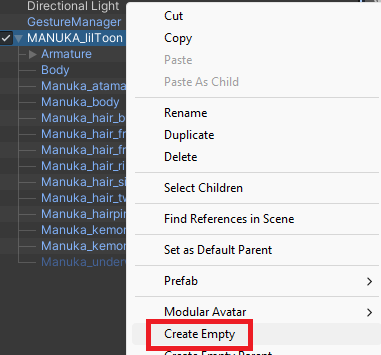
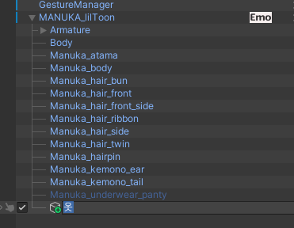
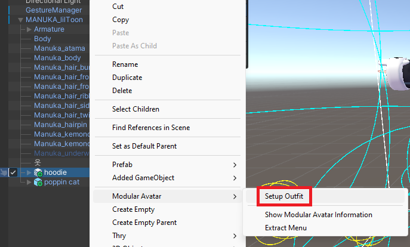
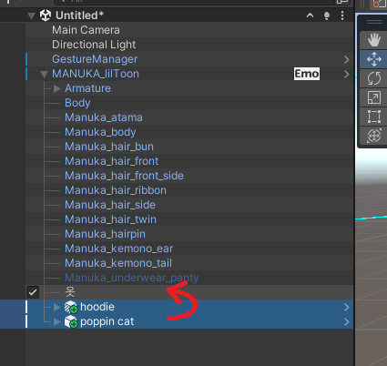
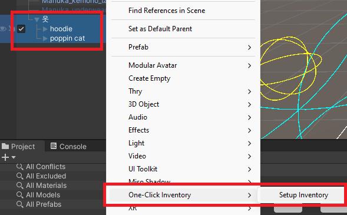
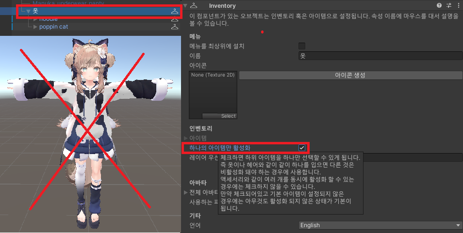
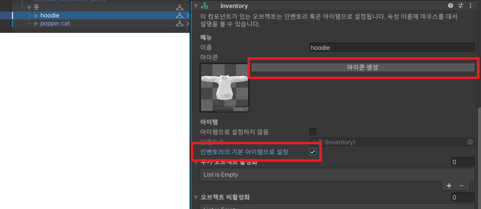
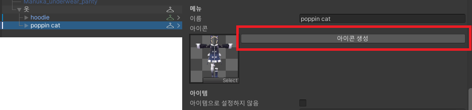
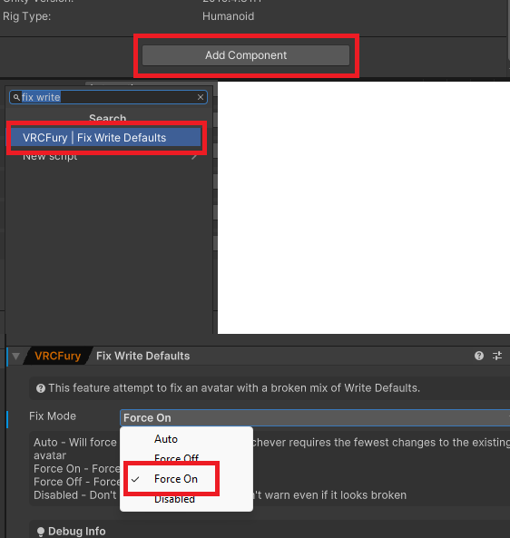

가장 기본적인 옷과 액세서리를 설정하는 옷장을 배웁니다.

## 튜토리얼

One-Click Inventory에서 옷장을 설정하기 위해선 옷장의 분류(옷, 헤어, 액세서리 등)를 나타내는 오브젝트가 필요합니다. 아바타 오브젝트를 오른쪽 클릭하고 \[Create Empty\]를 클릭해 새로운 오브젝트를 추가해봅시다.

새로 생긴 오브젝트의 이름을 적절히 바꿔주세요. 저는 옷이라고 해보겠습니다.

아바타에게 옷을 넣고 입힙니다. (Modular Avatar를 사용한다고 가정합니다)

입힌 옷을 아까 만든 "옷" 오브젝트에 넣어주세요.

그리고 입힌 옷과 "옷" 오브젝트를 전체 선택하고 오른쪽 클릭해서 \[One-Click Inventory/Setup Inventory\] 버튼을 클릭하여 옷장을 세팅해줍니다.

"옷" 오브젝트를 선택하고 Inspector 창에서 \[하나의 아이템만 활성화\]를 체크하겠습니다. 왜냐하면 옷은 여러 옷이 겹쳐 나오면 안되기 때문입니다. 옷장 메뉴에서 옷을 선택하면, 원래 입고 있던 옷은 비활성화 돼야합니다.

(옷장을 만들어본 사람들을 위한 설명: int 옷장이라고 볼 수 있습니다.)

그리고 입힌 옷 중 하나를 선택하고 Inspector 창에서 \[아이콘 생성\] 버튼을 누르고 \[인벤토리의 기본 아이템으로 설정\]을 체크하겠습니다. 이걸 체크 하지 않으면 기본으로 설정된 옷이 없기 때문에 아무것도 활성화되지 않은 상태 (알몸)이 기본이 됩니다.

마찬가지로 다른 옷도 \[아이콘 생성\]을 눌러서 아이콘을 만들어줄게요.

이렇게 하면 옷장 세팅이 끝납니다! Gesture Emulator를 이용하거나 VRChat에 업로드하여 테스트해보세요.

### 주의사항 (필독)

One-Click Inventory가 잘 작동하기 위해서는 아바타의 Write Defaults 설정이 ON으로 돼있어야 합니다. OFF인 경우에는 옷 전환이 제대로 안되거나 할 수도 있어요. (기본적인건 작동하긴 합니다)

하지만 Write Defaults가 뭔지 잘 모르시겠죠! 그럴때는 [VRCFury](https://vrcfury.com/)를 이용해서 아바타의 Write Defaults를 강제로 ON으로 설정하면 됩니다.

https://vrcfury.com/download

VRCFury의 공식 문서를 참고하여 설치하세요. 그리고 아바타에 \[Fix Write Defaults\] 컴포넌트를 추가하고 \[Force On\]으로 설정하시면 됩니다.

Write Defaults에 대한 추가 정보는 다음 링크에서 확인하세요.

https://creators.vrchat.com/avatars/

### 추가 정보

참고로 One-Click Inventory는 비파괴적으로 동작하기 때문에 Play 버튼을 누르거나 업로드할 때 아바타에 적용됩니다. 그렇기 때문에 아바타를 고장내지는 않을까 걱정하지 않아도 됩니다. 그냥 추가된 \[Inventory\] 컴포넌트만 제거하면 되니까요.
