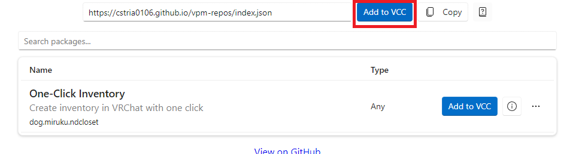
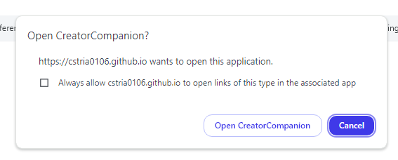
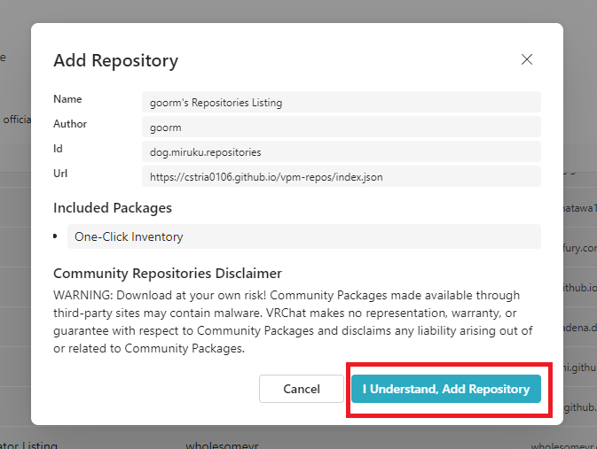
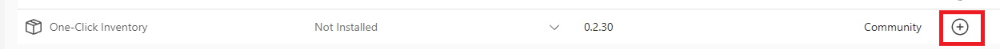

One-Click Inventory를 설치하는 방법을 배웁니다.

## 튜토리얼

One-Click Inventory는 부스에서 다운로드하거나 VCC (CreatorCompanion)으로 설치할 수 있습니다. 한 가지 방법만 사용하세요!

### 부스에서 다운로드

https://booth.pm/ja/items/5517179

무료 버전을 다운로드하시면 됩니다. 원하신다면 후원 금액을 설정하여 구매할 수도 있어요.

zip 파일을 압축 해제하고 unitypackage 파일을 직접 임포트 하시면 됩니다.

### VCC (CreatorCompanion)

https://cstria0106.github.io/vpm-repos/

위 링크에 접속하고 Add to VCC 버튼을 클릭합니다.

이런 창이 뜨면 \[CreatorCompanion에서 열기\]를 클릭합니다.

CreatorCompanion에서 \[I Understand, Add Repository\]를 클릭합니다.

CreatorCompanion의 프로젝트 목록에서 자신의 프로젝트의 \[Manage Project\] 버튼을 클릭합니다.

그리고 One-Click Inventory를 찾아 + 버튼을 클릭하면 설치 완료입니다.

